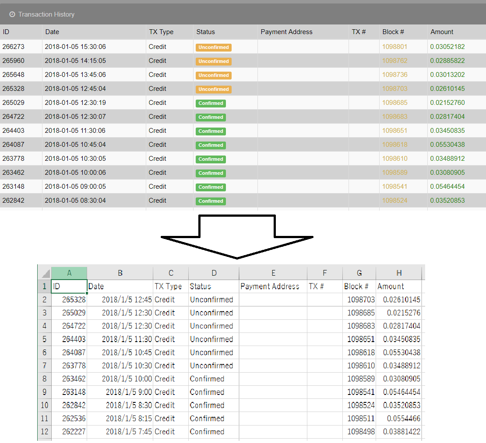

# readPool
bitZenyのプール利用者向けツールです。

## Description
Windowsソフト(rubyにて制作)

プールのTransaction History をcsv形式で取得するクローラーです。
どのタイミングでマイニングや払い出しをしたか管理するツール使用時に便利です。
プールへの負担軽減のため、デフォルトで1ページ30秒で取得します。(実質1件1秒です)

全プールで確かめたわけではありまん。自己責任でご使用ください。
### 現在確認済みのプール
  * [大人の自由研究](https://ukkey3.space/bitzeny)

## Usage

1. readPool.exeを起動
2. 指示に従って、取得したいプールのURL,id,password,出力先ファイル名を入力する
3. しばらく待つ

## Installation

  - [Download(Windows)](/master/readPool.exe)
  - other
    1. rubyの実行環境を用意する
    2. 実行環境を整える
      gem install nokogiri
      gem install mechanize
    3. [readPool.rb](/master/readPool.rb)を実行する(例: ruby readPool.rb)
## License

[MIT](LICENSE)
