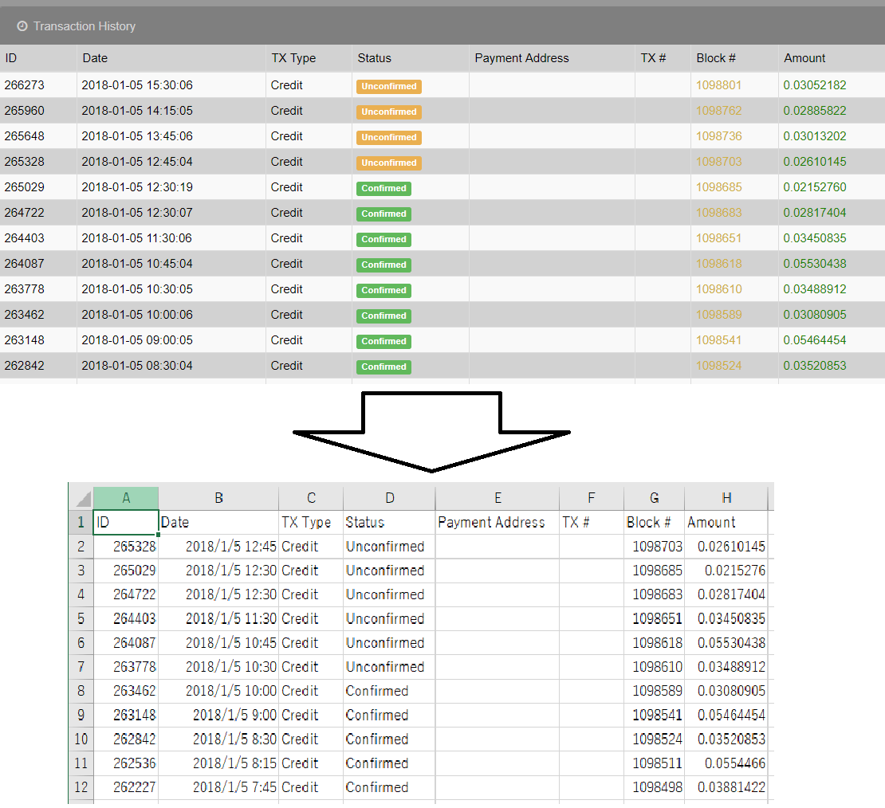
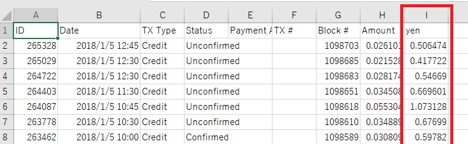

# index
- [readPool](#read-pool)... Transaction History をcsv形式で取得
- [margePrice](#marge-price)... readPoolで取得したcsvを利用してマイニング時の価格を記入してcsv出力
- [Author](#author)

***
# read-pool
readPoolはbitZenyのマイニングプール利用者向けツールです。

## Description
Windowsソフト(rubyにて制作)

プールのTransaction History をcsv形式で取得するクローラーです。
どのタイミングでマイニングや払い出しをしたか管理するツール使用時に便利です。
プールへの負担軽減のため、デフォルトで1ページ30秒で取得します。(実質1件1秒です)

全プールで確かめたわけではありまん。自己責任でご使用ください。
### 現在確認済みのプール
  * [大人の自由研究](https://ukkey3.space/bitzeny)

## Usage
インストール不要の実行型です。
1. readPool.exeを起動
2. 指示に従って、取得したいプールのURL,id,password,出力先ファイル名を入力する
3. しばらく待つ

  
<b>使用例(大人の自由研究)</b>

 
  1. ホストアドレスに https://ukkey3.space と入力してEnter 
  2. プールにログインする際のid(mail)を入力してEnter 
  3. プールにログインする際のpasswordを入力してEnter 
  4. 出力ファイル名を入力してEnter(実際の出力は出力ファイル名.csvとなる) 
  5. 取得量:xxと表示されたら取得できているので気を長くして待つ 

  
<b>advance Mode</b>

  対応してないプール用に引数で実行する方法があります。 
   ・引数0番目 -> poolHost 
   ・引数1番目 -> id 
   ・引数2番目 -> password 
   ・引数3番目 -> speed_mode(true or false) 
   ・引数4番目 -> login_url 
   ・引数5番目 -> trans_url 
  
  poolHost:  root階層まで入力してください 例)https://xxxxx.xxxx.xxx 
  id: ログインid, passwordはパスワード 
  speed_mode: 15秒で1ページ取得に変更するか(trueで高速化 
  login_url:  ログイン時のroot階層より先のurl 例) /bitzeny/index.php?page=login 
  trans_url:  root階層より先のTransaction Historyの存在するurl 例) /bitzeny/index.php?page=account&action=transactions 
  引数0個,2個,3個,4個,6個の際に実行可能になってます。 
  例) readPool.exe https://xxxxx.xxxx.xxx id pass 

## Installation

  - [Download(Windows)](/master/readPool/readPool.exe)
  - others
    1. rubyの実行環境を用意する
    2. 実行環境を整える
      gem install nokogiri
      gem install mechanize
    3. [readPool.rb](/master/readPool/readPool.rb)を実行する(例: ruby readPool.rb)

***

# marge-price
margePriceはマイニング時の値段を追記するツールです。
## Description
相場チャートからその日の相場を取得し、readPoolより生成したTransaction Historyのcsvにマイニング時の値段を追記します。

## Usage
インストール不要の実行型です。
1. readPoolから生成したcsvファイルを用意
2. margePriceを実行
3. 生成したcsvファイル名を入力してEnter
4. 出力先のファイル名を入力してEnter
あとは待つだけ
この際、[相場チャートのサイト](https://www.coingecko.com/ja/%E7%9B%B8%E5%A0%B4%E3%83%81%E3%83%A3%E3%83%BC%E3%83%88/bitzeny/jpy)から相場チャートを自動でDLします。zny-jpy-tmp.csvというファイルが生成されますが、削除してもらって構いません。

## Installation

  - [Download(Windows)](/master/margePrice/margePrice.exe)
  - others
    1. rubyの実行環境を用意する
    2. [margePrice.rb](/master/margePrice/margePrice.rb)を実行する(例: ruby margePrice.rb)
    
## author
 - twitter[@cyderts](https://twitter.com/cyderts)
 - bitZenyWallet `ZsexFk72EVrG129ZLhW7s8sQnT7t25Gwjg`
 
## License

[MIT](LICENSE)
